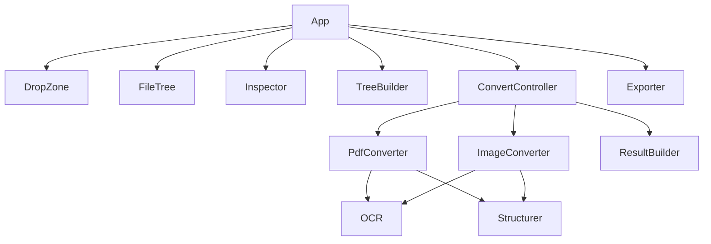

## 1. Stack
- Language: TypeScript (React 19, TSX)
- Framework/build: React 19 + Vite 6 (`vite`, `@vitejs/plugin-react`)
- Key libs: `pdfjs-dist` (PDF text-layer extraction), `tesseract.js` (OCR)
- Test: Vitest (`vitest run`)
- No backend — client-only app (per README.md)

## 2. Directory map
| path | what lives there |
|---|---|
| `index.html` | Vite HTML entry, mounts `#root`, loads `src/main.tsx` |
| `src/main.tsx` | React root bootstrap (`createRoot`, `<App/>`) |
| `src/App.tsx` | Root component: state reducer, wires input/output panels |
| `src/types.ts` | Shared TS types (`FileState`, `TreeNode`, etc.) |
| `src/styles.css` | Global styles |
| `src/components/` | UI: `DropZone.tsx`, `FileTree.tsx`, `Inspector.tsx` |
| `src/lib/` | Conversion pipeline: converters, OCR, structuring, tree/result building, export, syntax highlighting (`highlight.ts`) |
| `package.json` | npm scripts + deps (react, pdfjs-dist, tesseract.js) |
| `tsconfig.json` | TypeScript compiler config |

## 3. Diagram

## 4. Component index
- [[App]]
- [[DropZone]]
- [[FileTree]]
- [[Inspector]]
- [[TreeBuilder]]
- [[ConvertController]]
- [[Exporter]]
- [[PdfConverter]]
- [[ImageConverter]]
- [[ResultBuilder]]
- [[OCR]]
- [[Structurer]]

## 5. Entry points
- Dev: `index.html` → `src/main.tsx` via `npm run dev` (`vite`) — served at `http://localhost:5173/JSON_CONVERTER/` (README.md)
- Prod build: `npm run build` (`tsc --noEmit && vite build`), output `dist/` (README.md)
- Prod preview: `npm run preview` (`vite preview`)

## 6. Conventions (observed)
- React components as `.tsx` under `src/components/`; non-UI logic as `.ts` under `src/lib/` (directory layout)
- App state managed with a typed reducer + discriminated-union `Action` type (src/App.tsx)
- Async callbacks guard against stale closures via refs, e.g. `runRef` bumped on clear so in-flight conversions become inert, `liveRef` mirrors reducer state for use in exports (src/App.tsx comments)
- Relative imports, no file extensions (src/App.tsx, src/main.tsx)
- Unit tests colocated with source as `<name>.test.ts` next to `<name>.ts` (src/lib/structurer.test.ts, src/lib/treeBuilder.test.ts)
- `"type": "module"` in package.json — ESM throughout

## 7. Where things go
- New file-type converter: add `src/lib/<kind>Converter.ts`, wire it into `src/lib/convertController.ts`, extend kinds in `src/types.ts`
- New structure-detection rule (block type): `src/lib/structurer.ts` + `src/lib/structurer.test.ts` + `src/types.ts`
- New UI panel: `src/components/<Name>.tsx`, wire into `src/App.tsx`
- Change output JSON shape: `src/lib/resultBuilder.ts` + `src/types.ts` + README.md "Output shape" section
- New export format: `src/lib/exporter.ts`, add a trigger button in `src/App.tsx`
